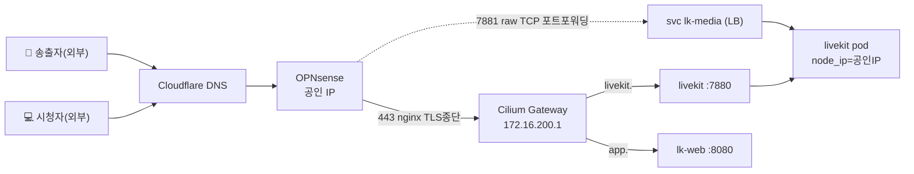

# livekit-homelab

홈랩 Kubernetes에 **LiveKit**(자체호스팅 WebRTC SFU)을 배포하여, 아이폰에서 카메라 영상을 **WebRTC over TCP**로 송출하고 PC 브라우저에서 시청하는 테스트 환경입니다. 설정·아키텍처·설치 절차를 전부 코드화했습니다.

> **시나리오: 송출자(핸드폰)·시청자(PC) 모두 외부(인터넷).** 이 전제 덕분에 미디어 후보가 공인 IP 단일값으로 충분하고 헤어핀/TURN이 불필요합니다. 내부 시청 등 다른 시나리오와 우리가 거친 설계 고민은 **[docs/design-decisions.md](docs/design-decisions.md)** 에 정리했습니다.

## 무엇을 하나

- 📱 **아이폰 Safari** → `https://app.basphere.dev/publish.html` → 카메라 송출 (publisher)
- 💻 **PC 브라우저** → `https://app.basphere.dev/view.html` → 실시간 시청 (subscriber)
- 🔒 미디어는 **TCP 단일 포트(7881)** 만 사용 (UDP 비활성). 시그널링은 WSS 443. 접근은 **비밀번호** 보호.
- ⏺ 선택적 **녹화(Egress)** → 로컬 PVC 저장.

## 아키텍처 한눈에



자세히: [docs/architecture.md](docs/architecture.md)

### 왜 미디어를 따로 노출하나?

WebRTC 미디어(DTLS/SRTP)는 HTTP/TLS 리버스 프록시나 Cloudflare 오렌지 프록시를 통과할 수 없습니다. 시그널링(WSS 443)은 nginx→Gateway로 가지만, **미디어 TCP 7881은 OPNsense에서 raw로 포트포워딩**합니다. LiveKit는 ICE 후보로 `공인IP:7881`을 광고하고 클라이언트가 그곳으로 직접 연결합니다.

## 디렉토리 구조

```
.
├── docs/             아키텍처·네트워크·OPNsense·녹화·트러블슈팅·설계결정
├── k8s/base/         raw YAML 템플릿 (livekit · redis · egress · app · gateway)
├── app/              웹앱 (토큰 서버 + 비밀번호 게이트 + publish/view 페이지) + Dockerfile
├── scripts/          render · install · uninstall · build-push · gen-token · record
├── config/           .env.example (배포 변수 템플릿)
└── rendered/         render.sh 산출물 (gitignore)
```

## 사전 요구사항

- 홈랩 Kubernetes (Cilium BGP LoadBalancer `lb-pool`, Gateway API `shared-gateway`)
- OPNsense (BGP peer, nginx proxy로 `*.basphere.dev` TLS 종단, ACME)
- 로컬 도구: `kubectl`, `envsubst`(gettext) **또는** `perl`, 이미지 빌드용 `docker`/`nerdctl`, (선택) `lk` CLI
  - **Helm 불필요** — 전부 raw YAML 템플릿.
- Cloudflare DNS: `livekit.basphere.dev`, `app.basphere.dev` → OPNsense 공인 IP (**DNS-only/grey**)

## 빠른 시작

```bash
# 1) 변수 채우기 (도메인/IP/키/버전/비밀번호 모두 변수화)
cp config/.env.example config/.env
$EDITOR config/.env     # PUBLIC_IP, LIVEKIT_API_KEY/SECRET, APP_PASSWORD, APP_IMAGE 등

# 2) 웹앱 이미지 빌드/푸시
./scripts/build-push.sh

# 3) 렌더 + 배포
./scripts/install.sh
#    렌더만 미리:  ./scripts/render.sh   (→ rendered/ 확인)

# 4) OPNsense 설정 (수동)
#    - DNS: livekit./app.basphere.dev → 공인 IP (grey)
#    - nginx proxy: 443 → Gateway 172.16.200.1  (docs/opnsense-nginx.md)
#    - 포트포워딩: 공인IP:7881 → lk-media LB IP:7881 (raw TCP)
#      ( kubectl get svc -n livekit lk-media )

# 5) 테스트
#    아이폰 Safari → https://app.basphere.dev/publish.html  (비밀번호 입력 → 카메라 송출)
#    PC 브라우저  → https://app.basphere.dev/view.html       (비밀번호 입력 → 시청 + 녹화)
```

- 변수화/배포: envsubst 템플릿(`k8s/base/**/*.yaml.tpl` + `config/.env`). Kustomize 전환: [docs/kustomize-migration.md](docs/kustomize-migration.md).
- 녹화: [docs/recording.md](docs/recording.md). 끄려면 `ENABLE_RECORDING=false`.

## 문서

| 문서 | 내용 |
|------|------|
| [docs/architecture.md](docs/architecture.md) | 전체 아키텍처(mermaid), 트래픽 흐름, 포트표 |
| [docs/design-decisions.md](docs/design-decisions.md) | **설계 결정·트레이드오프·시나리오**(외부-외부/외부-내부/헤어핀/coturn) |
| [docs/network.md](docs/network.md) | Cloudflare DNS, OPNsense 포트포워딩, Cilium BGP |
| [docs/opnsense-nginx.md](docs/opnsense-nginx.md) | nginx proxy (WSS upgrade) 설정 |
| [docs/recording.md](docs/recording.md) | 녹화(Egress) 사용법·컴퓨팅 사양·로컬 PVC |
| [docs/kustomize-migration.md](docs/kustomize-migration.md) | envsubst → Kustomize 전환 가이드 |
| [docs/troubleshooting.md](docs/troubleshooting.md) | 카메라/시그널링/ICE/비밀번호/녹화 디버깅 |

## 라이선스

테스트/학습용. LiveKit은 Apache-2.0.
