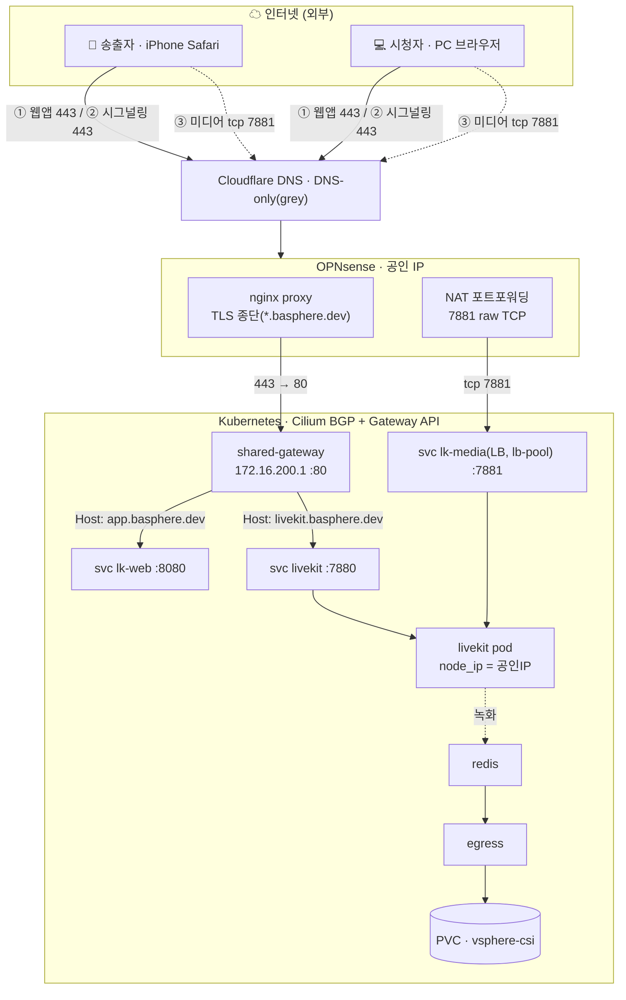
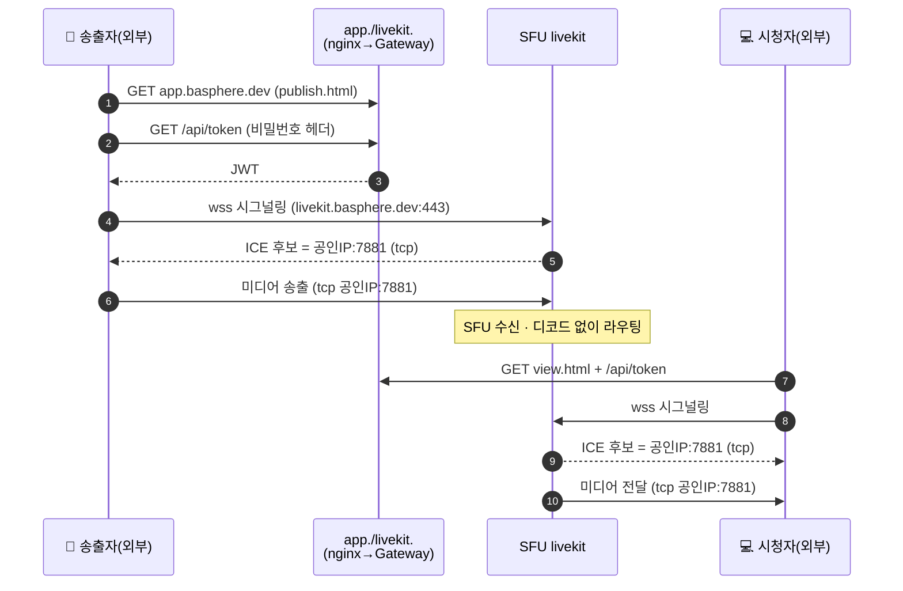

# 아키텍처

> 시나리오: **영상 송출자(핸드폰)와 시청자(PC) 모두 외부(인터넷)**. 이 전제에서 미디어 후보는 공인 IP 단일값으로 충분하며 헤어핀/TURN이 필요 없습니다.
> 내부 시청 등 다른 시나리오의 고민·대안은 [design-decisions.md](design-decisions.md) 참고.

## 구성 요소

| 구성요소 | 역할 | 노출 |
|----------|------|------|
| **livekit-server** | WebRTC SFU. 시그널링(7880) + 미디어 ICE/TCP(7881) | 시그널링은 Gateway, 미디어는 raw 포트포워딩 |
| **lk-web** | 토큰 발급(+비밀번호 게이트) + 녹화 제어 + publish/view 페이지 | Gateway (HTTPS) |
| **redis** | livekit ↔ egress 작업 버스 (녹화 시 필수) | 내부 |
| **egress** | 녹화 → 로컬 PVC 저장 | 내부 |
| **shared-gateway** | Cilium Gateway. Host 기반 L7 라우팅 (172.16.200.1) | BGP LB |
| **lk-media** | 미디어 TCP 7881 LoadBalancer (lb-pool) | BGP LB → 포트포워딩 |

## 전체 흐름



## 연결 순서



- **①② = 셋업(제어)**: 웹앱/토큰(`app.`)과 시그널링(`livekit.`). 둘 다 443(HTTP)이라 nginx→Gateway가 Host로 분기.
- **③ = 실제 영상**: 도메인이 아니라 **`공인IP:7881`**. 송출자·시청자 모두 외부라 동일 경로 → 대칭, 헤어핀 없음.

## 시그널링 vs 미디어 — 경로가 다른 이유

WebRTC 미디어는 **DTLS/SRTP 암호화된 비-HTTP 트래픽**이라 HTTP/TLS 리버스 프록시(nginx)나 Cloudflare 오렌지 프록시를 통과할 수 없습니다.

- **시그널링(WSS)**: 일반 HTTP/WebSocket → nginx가 TLS 종단 후 Gateway로 프록시.
- **미디어(ICE/TCP)**: nginx를 우회해 OPNsense에서 raw TCP로 포트포워딩. LiveKit가 ICE 후보로 `공인IP:7881`을 광고하고 클라이언트가 그곳으로 직접 연결.

## TCP-only 동작 원리

LiveKit config(`k8s/base/livekit/config.yaml.tpl` → Secret):
- `rtc.port_range_start: 0`, `rtc.port_range_end: 0` → **UDP 후보 비활성**
- `rtc.tcp_port: 7881` → 모든 미디어가 이 단일 TCP 포트로 mux
- `rtc.use_external_ip: false` + `rtc.node_ip: <공인IP>` → ICE 후보로 공인 IP 광고

## 포트 요약

| 포트 | 프로토콜 | 외부 | 경로 | 용도 |
|------|----------|------|------|------|
| 443 | TCP | ✅ | nginx→Gateway | 시그널링(WSS) + 웹앱(HTTPS) |
| 80 | TCP | ✅ | OPNsense ACME | 인증서 갱신 |
| **7881** | **TCP** | ✅ | **raw 포트포워딩 → lb-pool LB IP** | WebRTC 미디어(ICE/TCP) |
| 7880 | TCP | ❌ | Gateway→svc | LiveKit 시그널링 백엔드 |
| 8080 | TCP | ❌ | Gateway→svc | 웹앱/토큰 |
| 6379 | TCP | ❌ | 내부 | Redis (녹화 시) |
| 50000-60000 | UDP | ❌ 비활성 | — | UDP 미디어 (TCP-only로 끔) |

## 배포 토폴로지

```
namespace: ${K8S_NAMESPACE} (기본 livekit)
├── Deployment livekit-server (replicas:1) ─ Secret(config.yaml) 마운트
│     ├── Service livekit    ClusterIP    7880        (시그널링, Gateway 백엔드)
│     └── Service lk-media   LoadBalancer 7881/TCP    (lb-pool 자동 IP, externalTrafficPolicy:Local)
├── Deployment lk-web        ─ Secret(lk-web-secret: API키 + APP_PASSWORD)
├── Deployment redis         (녹화 시) ─ Service redis 6379
├── Deployment egress        (녹화 시) ─ Secret(egress.yaml) + PVC(/out)
└── (gateway-system) HTTPRoute x2 → livekit / lk-web   (parentRef: shared-gateway/http)
```

세부: [network.md](network.md) · [opnsense-nginx.md](opnsense-nginx.md) · [recording.md](recording.md) · 대안/트레이드오프: [design-decisions.md](design-decisions.md)
