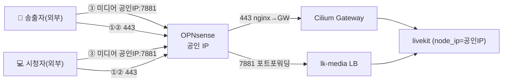
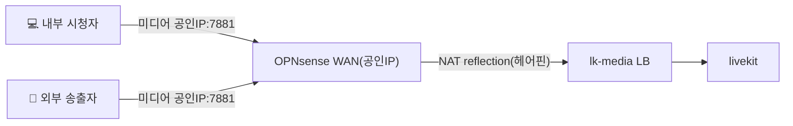
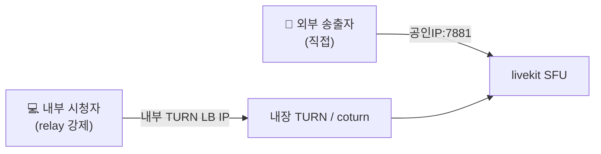
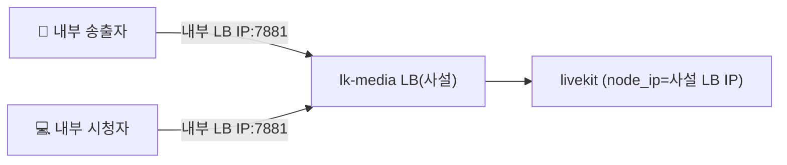

# 설계 결정 · 트레이드오프 · 시나리오

> 상태: **결정됨 (2026-05-31)** — 채택: **시나리오 1(외부-외부)**.
> 이 문서는 "왜 이렇게 설계했는가"와 우리가 검토한 시나리오·대안·기각 사유를 남긴다. 회사 재사용 시 같은 고민을 반복하지 않기 위함이다.

---

## 0. 두 개의 근본 원리 (모든 고민의 출발점)

### 원리 A — 시그널링과 미디어는 "목적지를 정하는 방식"이 다르다

| | 시그널링 (WSS) | 미디어 (ICE) |
|---|---|---|
| 무엇 | 룸 입장·토큰·SDP/ICE 후보 교환 | 실제 영상/음성 바이트 |
| 목적지 | 클라가 **도메인**으로 접속 (DNS→공인IP) | 서버가 알려준 **ICE 후보 IP**로 클라가 **직접** 다이얼 |
| 리버스 프록시 | nginx(L7) 통과 가능 (공인↔사설 다리 OK) | **불가**. 후보 IP로 직결 |

→ **미디어 후보 IP는 클라가 그대로 다이얼한다.** 외부 클라는 사설 IP를 라우팅 못 하므로, 외부 클라가 있으면 후보는 **반드시 공인 IP**.

### 원리 B — LiveKit `node_ip`(광고 IP)는 전역 단일 값이다

클라이언트별·방향별로 다른 IP를 줄 수 없다. (publisher/subscriber PC는 내부적으로 분리되지만 **같은 미디어 엔드포인트**를 공유)

이 두 원리가 "외부 송출 + 내부 시청"을 어렵게 만든다(시나리오 2).

---

## 1. 시나리오 1 — 외부-외부 ✅ **채택**

송출자·시청자 **모두 외부**. 내부 클라가 없으니 `node_ip=공인IP` 하나로 전원 직결, 헤어핀/TURN 불필요.

- ✅ 단순. BGP `lb-pool` + `shared-gateway` 정상 활용. coturn/hostNetwork/NAT reflection **불필요**.
- ⚠️ 대가: **홈랩 내부에서의 직접 시청은 이 설계로 안 됨**(내부 클라도 공인 IP 후보를 받아 헤어핀이 필요해짐 → 시나리오 2).

---

## 2. 시나리오 2 — 외부 송출 + 내부 시청 → **헤어핀 불가피**

외부 송출자 때문에 `node_ip=공인IP` 강제. 내부 시청자도 같은 공인 IP 후보를 받아, 자기 동네 공인 IP로 미디어를 보내야 함 → OPNsense **NAT reflection(헤어핀)** 필요.

이게 **A안**: 동작하지만 내부 시청 트래픽이 OPNsense를 한 번 되돌아 나간다.

### B안(hostNetwork 듀얼 후보)을 시도했으나 — **불가 (검증 완료)**

아이디어: hostNetwork로 LiveKit이 노드 LAN IP(내부용)와 공인 IP(외부용)를 **둘 다** ICE 후보로 광고 → 내부는 LAN IP 직결(헤어핀 0).

**왜 안 되나**: LiveKit은 외부 IP를 Pion **NAT-1-to-1 "Replace" 모드**로 처리한다. host 후보의 LAN IP를 공인 IP로 **교체**하므로 **한 IP만** 남는다.
- 유지인 [livekit#1898](https://github.com/livekit/livekit/issues/1898): *"단일 인터페이스로는 공인+사설 둘 다 못 준다. 서로 다른 인터페이스에 있으면 가능, 아니면 TURN."*
- [livekit#2088](https://github.com/livekit/livekit/issues/2088): `node_ip` 설정 시 그 IP만 광고(TCP/UDP 공히).
- **이 클러스터 노드는 전부 단일 NIC**(`10.254.0.224~233`), 노드에 공인 IP를 얹을 수도 없음(공인은 OPNsense 소유) → 듀얼 후보 조건 성립 불가. **B 기각.**

---

## 3. 시나리오 3 — 외부 송출 + 내부 시청, **헤어핀 없이 (C안: 내부 TURN relay)**

내부 시청자만 **내부 TURN(LiveKit 내장 TURN 또는 coturn)** 을 통해 relay → 미디어가 클러스터 내부에서 끝남. 비대칭은 **앱이 클라별 `rtcConfig`를 다르게** 주어 만든다(서버는 못 함).

- 앱(`lk-web`)이 요청 출처로 내부/외부를 판별 → 내부 클라엔 `iceTransportPolicy:'relay'` + 내부 TURN을 내려줌.
- ✅ 헤어핀 0. ⚠️ 구성요소↑ (내장 TURN/coturn + 내부 LB + 앱 분기 로직). ICE는 host 후보를 relay보다 우선하므로 **내부 클라에 relay 강제**가 핵심.
- 내부 시청자는 카메라를 안 쓰므로(secure context 불필요) 내부 경로는 HTTP+ws로도 가능 → 내부 TLS 생략 가능.

---

## 4. 시나리오 4 — 완전 폐쇄망 (전원 내부)

외부 클라가 아예 없으면 `node_ip=내부 LB IP`로 두면 전원 직결. 공인 노출·포트포워딩·헤어핀·coturn 전부 불필요. TLS는 Gateway/내부 CA로.

---

## 5. coturn(TURN) 심화 — 무엇이고 언제 필요한가

- **TURN = 미디어 릴레이(중계).** 클라가 SFU와 직접 연결을 못 맺을 때(NAT/방화벽) 미디어를 TURN으로 보내고 TURN이 SFU로 전달. **시그널링은 절대 안 거침**(시그널링은 항상 LiveKit으로, TURN 주소·자격증명도 시그널링으로 받음).
- **SFU를 대체하지 않음** — TURN은 "클라↔SFU" 구간의 우회 터널일 뿐, 팬아웃(1→N)은 끝까지 SFU가 한다.
- **항상 쓰는 게 아니라 ICE가 고르는 폴백** — 직접이 되면 직접, 막히면 relay.

**언제 진짜 필요한가** (두 경우):
1. **빡센 방화벽 통과**: 클라 네트워크가 7881을 막고 443만 허용 → **TURN/TLS 443**으로 미디어를 HTTPS처럼 터널링. (회사가 coturn 쓰는 주된 이유 = 사용자 망이 천차만별이라 연결 성공률 보험)
2. **시나리오 3의 내부 relay**: 내부 시청자를 내부 TURN으로 보내 헤어핀 제거.

- TURN/TLS 443은 기존 nginx의 443과 충돌하므로 **별도 공인 IP** 또는 **SNI 분기**(nginx stream `ssl_preread`)가 필요하다.
- LiveKit엔 **내장 TURN**이 있어 별도 coturn 없이도 같은 역할 가능.

---

## 6. 결정 요약 + 향후 재검토 트리거

**현재 채택 = 시나리오 1(외부-외부).** `node_ip=공인IP`, 미디어는 lb-pool LB + OPNsense 포트포워딩, 헤어핀/coturn 없음.

| 새 요구 | 이동할 시나리오 |
|---------|----------------|
| 홈랩 **내부에서도 시청** | 2(헤어핀, 간단) 또는 3(내부 TURN relay, 헤어핀 0·복잡) |
| 클라가 **7881 차단망**에 있음 | TURN/TLS 443 추가(§5) |
| **완전 폐쇄망** | 4 (node_ip=사설, 공인노출 제거) |

---

## 7. 참고

- LiveKit ICE/외부 IP: `mediatransportutil/.../webrtc_config.go`(`SetNAT1To1AddressRewriteRules`), Pion `ice/gather.go`(Replace 모드)
- 이슈: [#1898](https://github.com/livekit/livekit/issues/1898)(공인+사설 동시 불가), [#2088](https://github.com/livekit/livekit/issues/2088)(node_ip 단일 광고)
- 실 클러스터: 노드 9개 단일 NIC `10.254.0.224~233`, Gateway `shared-gateway`@`172.16.200.1`, LB풀 `lb-pool`(172.16.200.0/24), StorageClass `vsphere-csi`(RWO)
- 관련: [architecture.md](architecture.md) · [network.md](network.md) · [recording.md](recording.md)
