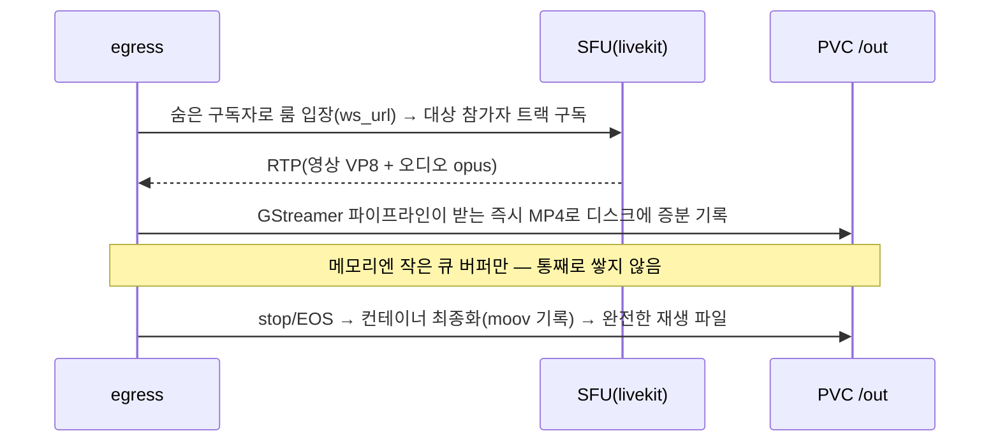

# 녹화 (LiveKit Egress)

발행 중인 영상+오디오 스트림을 실시간으로 녹화해 **로컬 PVC**에 `.mp4`로 저장합니다.

## 핵심 사실

- **Egress는 별도 서비스**입니다. livekit-server와 **Redis로만** 통신하므로, 녹화를 켜면 Redis 배포가 **필수**입니다. server/egress가 같은 Redis(`${REDIS_ADDRESS}`)를 바라봐야 합니다.
- **S3는 필수가 아닙니다.** 본 프로젝트는 **로컬 PVC**(`${RECORDING_PATH}`, 기본 `/out`)에 저장합니다. egress 설정에 스토리지 백엔드를 두지 않으면 파일 출력 경로(PVC)에 그대로 기록됩니다.
- 단일 영상+오디오 스트림 녹화는 **Participant Egress** 를 사용합니다 → 헤드리스 Chrome 불필요, 가볍습니다.

## 동작 원리 (파이프라인)



- **메모리에 통째로 담지 않습니다.** 받는 즉시 PVC 디스크의 `.mp4`로 증분 기록하고, RAM에는 작은 큐 버퍼만 둡니다. (장시간 녹화도 메모리 안전)
- **MP4 최종화는 종료(stop) 시점**에 일어납니다. 미디어는 녹화 중 계속 디스크에 쓰이지만 컨테이너 인덱스(moov)는 stop 때 기록되므로, **중간 파일은 온전히 재생되지 않을 수 있고 stop 후 완성**됩니다.
- 그래서 egress 파드는 `terminationGracePeriodSeconds: 3600` 으로 종료 시 진행 중 녹화를 flush·최종화합니다. **녹화 중 파드가 강제 종료되면 그 파일은 손상**될 수 있습니다.

## 컴퓨팅 사양 (공식 가이드 기반)

| 방식 | Chrome | CPU/메모리(인스턴스당) | 동시 처리 |
|------|--------|------------------------|-----------|
| **Participant / Track Composite** | ❌ | 베이스라인 ~**4 CPU / 4 GB** | 여러 개 가능 |
| Track (raw, 무변환) | ❌ | 매우 적음 | 수백 개 |
| **Room Composite / Web** | ✅ | **2~6 CPU / 4 GB+**, `/dev/shm` 필요 | 인스턴스당 방 1개 |

- 본 데모(Participant Egress)는 `EGRESS_CPU=4`, `EGRESS_MEMORY=4Gi`(`.env`)로 설정됩니다.
- Room Composite로 바꾸려면 CPU를 6 이상으로 올리고 `/dev/shm`(EGRESS_SHM_SIZE) 메모리가 필요합니다. 인스턴스당 동시 1개 방만 녹화되므로, 여러 방을 동시에 녹화하려면 replica를 늘리거나 오토스케일링이 필요합니다.
- egress 파드는 진행 중 녹화를 완료(flush)하기 위해 `terminationGracePeriodSeconds: 3600` 으로 설정되어 있습니다.

> **실측 — Participant Egress는 매우 가볍습니다.** 1080p 단일 스트림 녹화 중에도 CPU는 0.x 코어 수준(유휴 ~7m, mem ~21Mi). 이유: **트랜스코딩이 아니라 리먹스(passthrough)** — 이미 인코딩된 트랙(VP8/opus)을 재인코딩 없이 컨테이너에 담고 타임스탬프만 정렬(로그의 `adjusting PTS offset`)합니다. 무거운 4~6 CPU는 **Room Composite**(Chrome 합성+재인코딩) 한정. → `EGRESS_CPU` request/limit를 낮추거나 동시 녹화 다수를 한 노드에서 돌릴 수 있습니다.
>
> **코덱/호환성**: 리먹스라 파일에 원본 코덱(VP8/opus)이 담깁니다. `.mp4` 확장자라도 VP8은 QuickTime 등 일부 플레이어가 못 엽니다(VLC/Chrome OK). `ffprobe <file>` 로 확인. 범용 H.264/AAC가 필요하면 ① 송출 코덱을 H.264로 지정(리먹스 유지, 가벼움) 또는 ② egress 트랜스코딩(CPU↑).

## 로컬 PVC 저장 — 주의사항

- 파일은 **egress 파드의 PVC 내부**(`${RECORDING_PATH}`)에 저장됩니다. 녹화 진행 중 파드가 죽으면 해당 파일은 유실됩니다.
- 기본 접근모드는 `ReadWriteOnce`(`RECORDING_PVC_ACCESS_MODE`). 이 클러스터 기본 StorageClass는 `vsphere-csi`(RWO, `WaitForFirstConsumer`)이므로 단일 egress 파드에 적합합니다. 여러 파드/외부에서 함께 보려면 `ReadWriteMany`(NFS 등) StorageClass로 바꾸세요.
- 파일 꺼내기 (파드 이름 자동 조회):
  ```bash
  NS=${K8S_NAMESPACE:-livekit}
  # 1) 녹화된 파일 목록 (stop 된 파일이 완성본)
  kubectl exec -n "$NS" deploy/egress -- ls -lh ${RECORDING_PATH:-/out}

  # 2) 로컬로 복사
  POD=$(kubectl get pod -n "$NS" -l app=egress -o jsonpath='{.items[0].metadata.name}')
  kubectl cp "$NS/$POD:${RECORDING_PATH:-/out}/<파일>.mp4" ~/Downloads/<파일>.mp4
  ```
  > `<파일>`은 위 1) 목록의 `demo-room-<identity>-<시각>.mp4`. 같은 이름의 `.json`은 egress 메타데이터. 녹화가 **stop 된 후** 복사해야 완전한 파일입니다.
  > `scripts/record.sh start <identity>` / `stop <egressId>` / `list` 로 CLI 제어도 가능합니다.
- 향후 S3/MinIO로 전환하려면 egress 설정(`k8s/base/egress/secret.yaml.tpl`)에 `s3:` 블록을 추가하고 녹화 요청의 출력 대상을 S3로 바꾸면 됩니다(코드에 주석으로 표시).

## 녹화 시작/중지

웹앱(`lk-web`)의 토큰 서버가 Egress 제어 API를 노출합니다. `view.html` 화면의 **녹화 시작/중지** 버튼으로 호출하거나 직접 호출할 수 있습니다.

```bash
# 시작 — 특정 참가자(identity)를 녹화
curl -X POST https://${APP_HOST}/api/record/start \
  -H 'content-type: application/json' \
  -d '{"room":"demo-room","identity":"phone-user"}'
# → {"egressId":"EG_xxx"}

# 중지
curl -X POST https://${APP_HOST}/api/record/stop \
  -H 'content-type: application/json' \
  -d '{"egressId":"EG_xxx"}'
```

내부적으로 `livekit-server-sdk`의 `EgressClient.startParticipantEgress()`를 호출하며, 출력은 `EncodedFileOutput`(로컬 파일)로 설정됩니다(`app/server.js` 참고).

### lk CLI 로 직접 (디버그)

```bash
# scripts/gen-token.sh 로 토큰 발급 후
lk egress start-participant-egress \
  --room ${DEFAULT_ROOM} --identity phone-user \
  --output-file ${RECORDING_PATH}/{room_name}-{publisher_identity}-{time}.mp4

lk egress list
lk egress stop --id <EGRESS_ID>
```

## 녹화 끄기

`config/.env`에서 `ENABLE_RECORDING=false` 로 두고 `render.sh`/`install.sh`를 다시 실행하면 redis/egress가 제외되고, livekit-server는 Redis 없이 단독 동작합니다.
